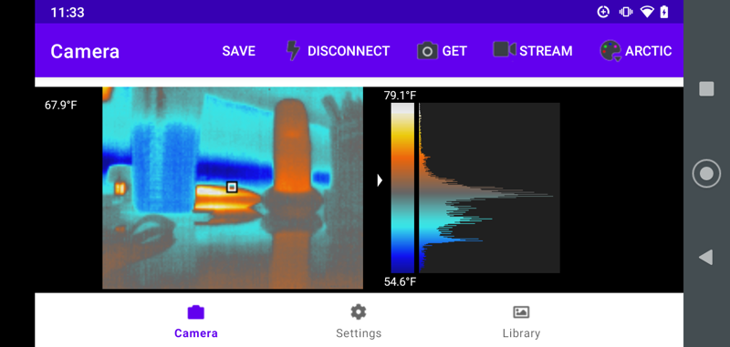
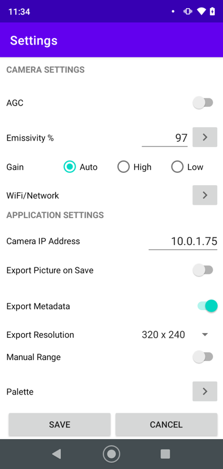
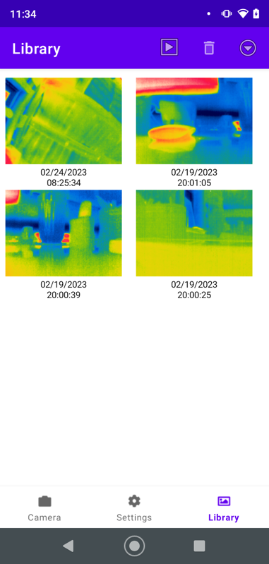
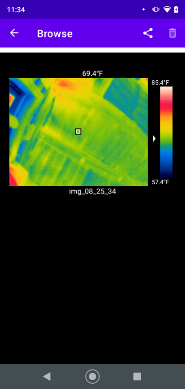

## tCam Android Application
This repository contains the Alpha Testing Version of the tCamViewer for Android.  This application is designed to work with danjuliodesigns, LLC [tCam family](https://github.com/danjulio/tCam) cameras.

### Release Notes
This is an alpha release, designed for early testing. It may have issues and you are encouraged to use the github issues tracker to log them. Also any suggestions on how the application may be improved are appreciated  

### Known Issues
1. Streaming is slow and sparadic, it will be addressed in a future release
2. If the camera becomes disconnected from the application, the user needs to maually disconnect and connect from the menu to re-establish the connection

### Installation
The tCamViewer can be installed directly from the invitation email that you received when you requested participation in the Alpha Testing Program.  The following video shows how to install the application from the email that you received. Your particular Android phone may varying in the dialogs, etc. that are shown in the video, but the overall procedure should be the same.

https://user-images.githubusercontent.com/589331/221420834-ada5d647-df58-4461-8c1c-33f3b580cb60.mov

### Operation
The app has four screens.

#### Camera Screen

The Camera Screen is used to view and save images from the camera. 

1. CONNECT/DISCONNECT - Manage connection to a camera (a valid IP address must be configured first).
2. GET - Get an image from the camera and display it.
3. STREAM - Start or stop streaming.
4. Pallete - Select the palette to use when colorizing the image.  The palette may also be changed by touching the top or bottom of the palette bar to rotate forwards/backwards through the palattes
5. SAVE - Save the current image to the library in tjsn format.

Touching the image will set the spot meter to that location.  The spot meter will be updated on the image when the next image is obtained (via GET or when streaming).

#### Settings Screen

The Settings Screen is used to configure both the camera and the app.  Note that the CAMERA SETTINGS section is only displayed when the app is connected to a camera.  Clicking SAVE will update the camera and app.  Clicking CANCEL will throw away any changes.

#### Library Screen

The Library Screen displays saved tjsn files.  Click on an image to select it for browsing or deletion.  Click the Playback button to browse selected images.  Click the Trashcan icon to delete them.

#### Browse Screen

Swipe left or right to move between selected images.  Touch the top or bottom of the palette bar to change palettes.  Click the Sharing button to export jpeg versions of the image to the phone's photo library.  Click the Trashcan to delete the image.
