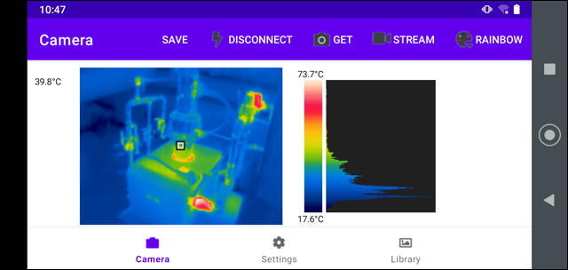
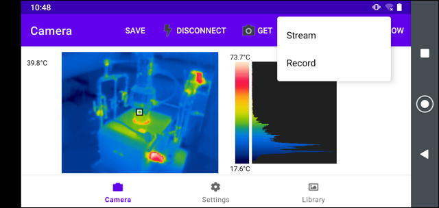
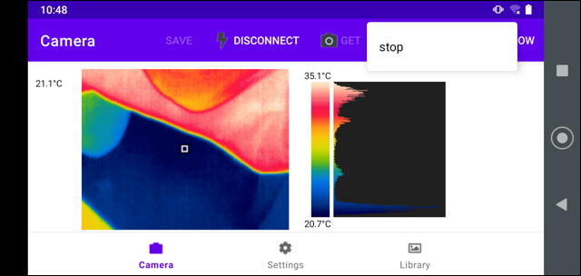
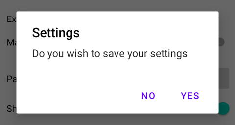
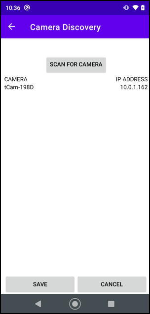
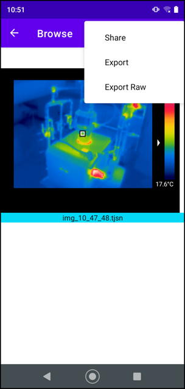

# tCamViewer Operating Instructions
Version 1.0

tCamViewer is an Android app designed to connect to the tCam and tCam-Mini thermal imaging cameras designed by [danjuliodesigns, LLC](https://www.danjuliodesigns.com) and available from [Group Gets](https://www.groupgets.com).

## Installation
The app may be installed from the [Google Play Store](https://play.google.com/store/apps/details?id=com.danjuliodesigns.tcamViewer) or through side loading. To side load an application the phone must have developer mode enabled and allow unknown applications to be installed. These settings are phone dependent, please check your phone's user manual for specific instructions of how to do this. 

## Operation
Operation of the app is controlled by three main screens.

1. Camera Screen : This is the initial screen and controls the connection to the camera, displays images and video from a connected camera, and allows the images to be saved.
2. Settings Screen : Configures the application and the connected camera, it also allows scanning for connected cameras.
3. Library Screen : Displays saved images and movies and allows them to be exported.

### Camera Screen
The Camera Screen


It is comprised of a toolbar and image display area.  Toolbar items include the following.


1. **SAVE** : Saves the currently displayed image as a raw .tjsn file in the applications's local file storage area.  Not available if there is not a current image displayed.
2. **CONNECT** : Connect to a camera via WiFi at the network address specified on the Settings Screen.  The menu item changes to **DISCONNECT** when a camera is connected. If a camera fails to connect (usually because of an incorrect IP address or being powered off) then an popup will be displayed within 15-30 seconds informing the user of the problem.
3. **GET** : Obtains a single image from the connected camera.
4. **STREAM** : Start a streaming images from the camera in real time.  Video of the streaming images can be saved as a .tmjsn video file in the application's local file storage area. 
5. [**PALETTE**] : Displays the current palette being used to display the image. Selecting this menu item shows a drop down menu of all of palettes choices available.
<br/>
<br/>


The image area is comprised of the following regions.

1. *Spot Temperature* : Displays the camera's spot meter temperature in the currently configured units if spot meter display is enabled.
2. Image : Displays the thermal image using the currently selected palette.
3. *Palette Bar* : Displays the current palette with the image's minimum and maximum temperatures (or the word "AGC" if the camera is configured in AGC mode). Clicking on the top or the bottom half of the Palette Bar will select the previous or next palette respectively.
4. *Histogram* : Displays a histogram of temperatures distributed over the image's temperatures.



<br/>
<br/>
Streaming displays a live view from the camera at the maximum rate of ~9 FPS when the user selected the **STREAM** menu item. Streams may be persisted to a .tmjsn file by selecting **Record** instead of **Stream** and later viewed in the Library screen.


<br/>
<br/>
Streaming/Recording may be terminated by clicking **STREAM** menu item and then selecting "stop".  The video file is saved if recording was selected.

A recording stream is also stopped and the video file saved if the user navigates away from the Camera Screen.  A non-recording stream is temporarily paused and then re-started if the user navigates away from the Camera Screen and then back.

#### Native File Name formats
Native image files (.tjsn and .tmjsn) are stored in sub-directories within the application's local file area.  Their filenames are generated by using the timestamp when they were taken and are stored in folders with names generated by the date they were taken.
<br/>
<br/>

<br/>
<br/>

These files may be copied from the phone via the USB interface and shared with the tCam Desktop application available from [danjuliodesigns, LLC](www.danjuliodesigns.com) or they may exported.

#### Exported Files

Images may be saved as jpg files.  They may be exported automatically from the Camera Screen when clicking **SAVE** (if enabled in the Settings Screen), or they may be manually exported while viewing images from the Library Screen.  Saved images may be found in the photo album.

Videos may be saved as mp4 files.  The process takes may take some time depending on the length of the recorded stream.  

Exported images and movies may simply be the image or may include metadata displayed as text around the image depending on the settings selected in the [Settings Screen](#Settings Screen).

### Settings Screen

The Settings Screen is used to configure both the application and the connected camera.
<br/>
<br/>

<br/>
<br/>
The Camera Settings section is only displayed when a camera is connected.  Current camera values are obtained when the Settings Screen is displayed.

Click *SAVE* or *CANCEL* to leave the Settings Screen and return the Camera Screen.  Changes made to the Settings Screen will only be applied if *SAVE* is clicked and *YES* is selected on the pop-up. 
<br/>
<br/>

<br/>
<br/>
#### Application Settings

1. *Camera Address* : Sets the IPV4 address for the camera.  This address should be on the same network the phone is connected too.  Selecting the **```>```** button displays the Camera Discovery screen described below and may be used to find available cameras on the current network.
2. *Export Picture on Save* : Saves a jpg version of the image in the phone's photo album when **SAVE** is pressed on the Camera Screen in addition to the .tjsn file stored in app's file area.
3. *Export Metadata* : Saves additional information displayed as text around the image for images and videos saved as jpg or mp4 files.
4. *Export Resolution* : Sets the resolution for the image portion of images and videos exported as jpg or mp4 files.
5. *Manual Range* : Enables configuring a manual temperature range (minimum and maximum) used when scaling the radiometric data from the camera to display on the Camera Screen.  May be useful to analyze temperatures within a smaller range than captured in the whole scene.  Displays two entry areas for Minimum and Maximum temperature when enabled.
6. *Palette* : Sets a palette to use when displaying images on the Camera Screen.
7. *Shutter Sound* : Enables or disable playing a Camera shutter sound when clicking SAVE on the Camera Screen.
8. *Spotmeter* : Enables or disables display of the spot meter and spot meter temperature on images displayed on the Camera Screen or viewed in the Library Screen.
9. *Units* : Selects the units (Imperial or Metric) used to display temperature values.
10. *Version* : Application version.
11. *Privacy Policy* : Displays the application's privacy policy and support email address.

##### Camera Discovery
The Camera Discovery screen shows all active cameras connected to the same network as the phone.
<br/>
<br/>

<br/>
<br/>

Click *SCAN FOR CAMERA* to get a list of all available cameras.  Then select the camera and click *SAVE* to change the Settings Screen Camera Address.

Note that when the Camera is acting as an Access Point and the application is connected to it, the Camera will have the fixed IPV4 address 192.168.4.1 and the application will receive the address 192.168.4.2.  Only one device may connect to a camera when it is acting as an AP at a time.

##### Metadata
An example 320x240 pixel image with metadata is shown below.
<br/>
<br/>


<br/>
<br/>

#### Camera Settings

Camera Settings are displayed when a camera is connected.  Current values are obtained from the camera.

1. *AGC* : Select between the camera's AGC and Radiometric modes.  When AGC mode is selected the data from the camera does not contain temperature data (other than the spot meter) but the image may be higher quality.  When Radiometric mode is selected the the data contains temperature data for each pixel in the image.
2. *Emissivity* : Sets the emissivity for the camera to use when computing temperatures.  Emissivity is represented by an integer percentage value 1 - 100.  A list of emissivity values for common materials may be displayed and selected by pressing the ```>``` button.
3. *Gain* : Sets the gain mode for the camera.  AUTO allows the camera to automatically select high or low operating gain depending on the scene currently being imaged.  HIGH forces the camera into high gain.  LOW forces the camera into low gain.  High gain is typically used for scenes with a lower delta temperature between the minimum and maximum temperatures in the scene and offers 0.01°K resolution, higher accuracy and lower noise.  Low gain is typically used for scenes with a high delta between the minimum and maximum temperatures and offers 0.1°K resolution, slightly lower accuracy and higher noise.
4. *Wifi/Network* : Displays the Wifi/Network Settings screen and allows configuration of the camera Wifi and network settings.

Changes made to AGC, Emissivity and Gain are not saved unless SAVE is selected and confirmed when leaving the Settings Screen.  Settings to Wifi/Network saved from the Wifi/Network Settings screen.

##### Wifi/Network Settings
The Wifi/Network Settings screen is used to configure the following.

1. Camera Wifi configuration
2. Camera Network configuration
<br/>
<br/>


<br/>
<br/>

Camera Wifi configuration items include the following.  All three must be configured when changing Wifi/Network settings.

1. *Camera is Access Point* : Configure the camera to act as an Access Point (AP) with the specified SSID and WPA password when selected.  Configure the camera to act as a client to an existing Wifi network when de-selected.
2. *SSID* : Sets the Camera SSID name when it is configured as an AP.  Sets the name of the Wifi network to connect to when it is configured as a client.  SSIDs must be 1 - 32 characters in length.
3. *Password* : Sets the Camera's WPA password when it is configured as an AP.  Sets the password to use when connecting to an existing Wifi network when it is configured as a client.  Passwords must be 8 - 63 characters in length.

Camera Network configuration items include the following.  They must only be configured when Use Static IP when Client is enabled.

1. *Use Static IP when Client* : Configures the camera to have a static, pre-set, IPV4 address and netmask when selected.  Configure the camera to obtain a DHCP-served address and netmask when de-selected.
2. *Client Static IP Address* : Sets the static IPV4 address when configured to use a static IP address.
3. *Client Static IP Netmask* : Sets the static IPV4 netmask when configured to use a static IP address.

Be sure to configure a valid static address that exists on the network or the camera will become inaccessible (it's network will have to be manually reset).

Changes are made to the camera when *SAVE* is selected.  Note that the application will disconnect from the camera when changes are made.

### Library Screen

The library screen shows .tjsn image files and .tmjsn video files stored in the app's local storage.
<br/>
<br/>

<br/>
<br/>

Files must be selected first.  They may then be viewed with the ```>``` button or deleted with the Trashcan button.

#### Browse Screen

Selected files are displayed, one at a time, in the Browse Screen.
<br/>
<br/>

<br/>
<br/>

Swipe left or right to move between files.  Touch the top or bottom of the Palette Bar to change the palette.  Click the *Trashcan* button to delete the file.

#### Playback Screen

Click the play button under video files displayed in the Browse Screen to play them in the Playback Screen.
<br/>
<br/>

<br/>
<br/>
You may pause or restart the video, change the playback direction or jump to the beginning or end.

#### Sharing/Exporting

Click the sharing button on the Browse screen to share the file.  
<br/>
<br/>

<br/>
<br/>

1. *Share* : Converts the file to a named jpg and shares it using the Android share mechanism allowing sending by email or sharing with other applications.  The first image in a video file is converted as the jpg image.
2. *Export* : Converts an image file to a jpg file and stores it in the camera's photos directory.  Converts a video file to a mp4 file and stores it in the camera's movie directory.  Video conversion may take some time, depending on the size of the video file, and a dialog box is displayed during the conversion.
3. *Export Raw* : Saves the .tjsn or .tmjsn raw image files to a directory on the phone.  A file dialog box is displayed allowing changing the file name and selecting the destination directory.
